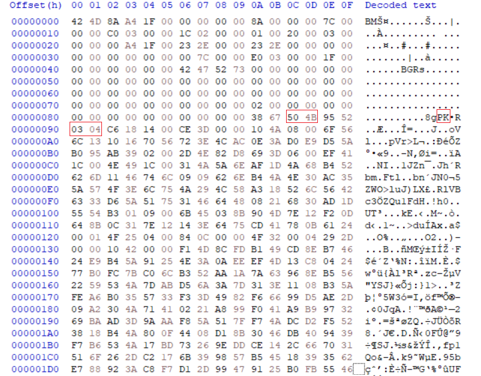
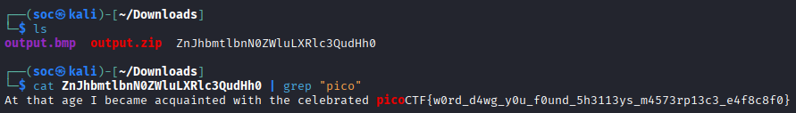

## Invisible WORDs
Sau khi tải về và giải nén thì được ảnh `output.bmp`.
Thực hiện kiểm tra `file`, `exiftool`, `binwalk`, `LSB`, `colorpane` thì không có gì. Sử dụng `HxD` để xem hex của ảnh thì thấy có đoạn `50 4B 03 04` như header của file `.zip`


Viết script để trích xuất file `.zip`
```python    
zip_file = open("output.zip","wb")
with open("output.bmp","rb") as f:
   hdr = f.read(0x8a)
   skip = f.read(2)
   while skip:
      keep = f.read(2)
      zip_file.write(keep)
      skip = f.read(2)
zip_file.close()
```

Giải nén thì được file text bên trong chứa flag


FLAG: **picoCTF{w0rd_d4wg_y0u_f0und_5h3113ys_m4573rp13c3_e4f8c8f0}**