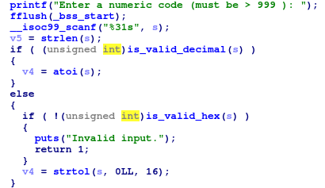
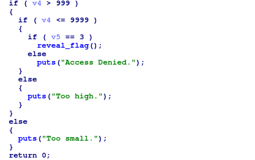
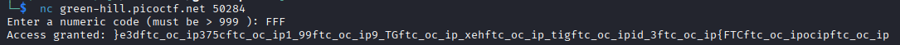
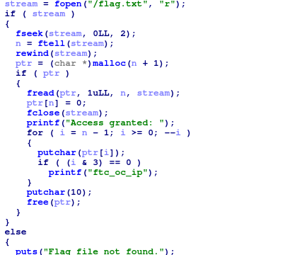
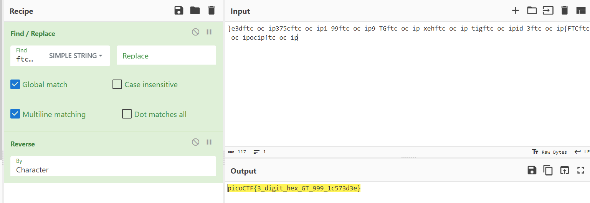

## Gatekeeper
### Đề bài
What’s behind the numeric gate? You only get access if you enter the right kind of number. You can download the program file

### Giải
Sau khi tải xuống được file `gatekeeper` là file thực thi ELF. Sử dụng IDA để dịch ngược. Chương trình thực hiện nhận input và kiểm tra có phải số thập phân hoặc không và thập lục phân hay không. Logic kiểm tra thập lục phân chỉ chạy khi không phải thập phân (input chứa ký tự không phải số)

Chương trình thực hiện chuyển input thành số và kiểm tra điều kiện in flag: số thuộc khoảng 1000 đến 9999 và độ dài input là 3. Do không có số thập phân nào thỏa mãn >= 999 mà có 3 chữ số nên cần nhập số thập lục phân để in flag

flag được in ra đã bị làm rối, đọc hàm `reveal_flag` thì thấy nó thực hiện đọc file `flag.txt`, in ngược lại và mỗi 4 ký tự thì chèn cụm "ftc_oc_ip". Sử dụng cyberchef để khôi phục flag

FLAG: **picoCTF{3_digit_hex_GT_999_1c573d3e}**