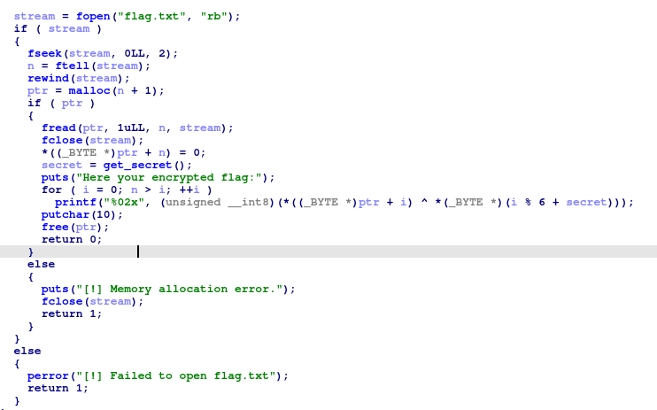
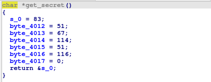
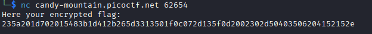
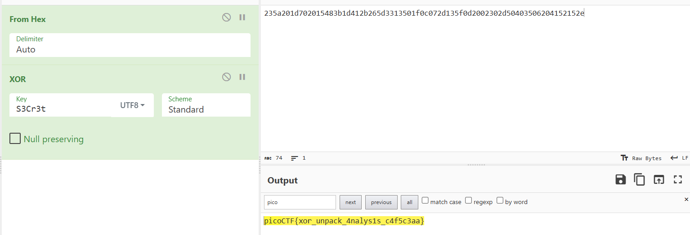
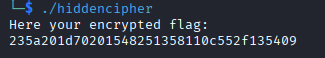
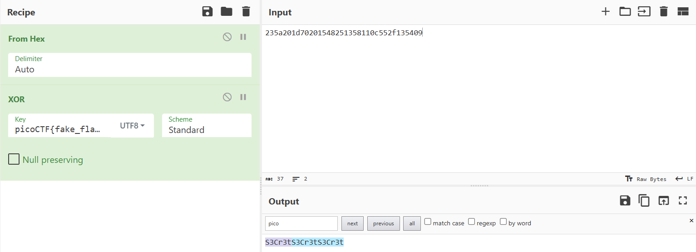

## Hidden Cipher 1
### Đề bài
The flag is right in front of you; just slightly encrypted. All you have to do is figure out the cipher and the key. You can download the program files

### Giải
Sau khi tải về thì được file `hiddencipher` là file thực thi ELF và file `flag.txt` chứa fake flag để test. Sử dụng Detect It Easy thì thấy file  `hiddencipher` được nén UPX, thực hiện giải nén và dịch ngược bằng IDA
```
die hiddencipher
upx -d hiddencipher
```

Chương trình thực hiện đọc file `flag.txt` và XOR với chuỗi được tạo từ hàm `get_secret` và in ra encrypted flag dưới dạng hex


Hàm `get_secret` được hardcore trả về chuỗi "S3Cr3t"


Kết nối đến instance, nhận encrypted flag và XOR với "S3Cr3t" để được flag ban đầu



FLAG: **picoCTF{xor_unpack_4nalys1s_c4f5c3aa}**

>[!Note] 
> Bài này có thể dựa vào gợi ý XOR của đề bài cùng với plain text picoCTF{fake_flag} và chuỗi encrypted flag từ fake flag để tìm ra key


