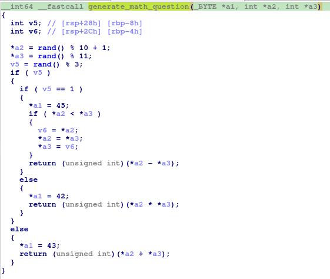
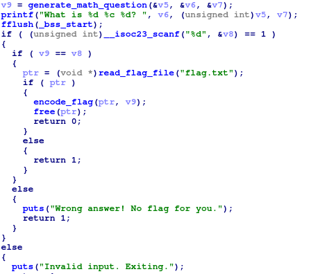
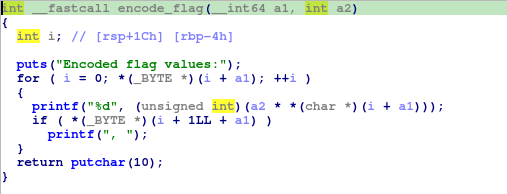
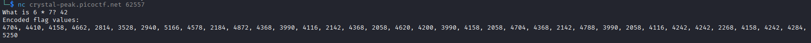

## Hidden Cipher 2
### Đề bài
The flag is right in front of you... kind of. You just need to solve a basic math problem to see it. But to get the real flag, you’ll have to understand how that math answer is used. You can download the program files 

### Giải
Sau khi tải về thì được file `hiddencipher2` là file thực thi ELF và file `flag.txt` chứa fake flag để test. Sử dụng IDA dịch ngược `hiddencipher2` 

Hàm `generate_math_question` sinh ra ngẫu nhiên 2 số thuộc khoảng `1->10`, và phép tính `+`/`-`/`*` và trả về kết quả phép tính


Chương trình in ra phép tính và nhận input của người dùng, so sánh với kết quả phép tính, nếu đúng thì gọi hàm `encode_flag`


Hàm `encode_flag` nhận vào chuỗi flag, chuyển thành ascii và nhân với kết quả phép tính chính xác và in ra dãy số kết quả, viết script giải



``` python
import re

encoded_flag = "4704, 4410, 4158, 4662, 2814, 3528, 2940, 5166, 4578, 2184, 4872, 4368, 3990, 4116, 2142, 4368, 2058, 4620, 4200, 3990, 4158, 2058, 4704, 4368, 2142, 4788, 3990, 2058, 4116, 4242, 4242, 2268, 4158, 4242, 4284, 5250"
divide = 42
flag = ""

for number in re.findall(r"(\d+)", encoded_flag):
    flag += chr(int(number)//divide)

print(flag)
```

FLAG: **picoCTF{m4th_b3h1nd_c1ph3r_1bee6cef}**