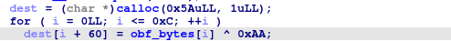
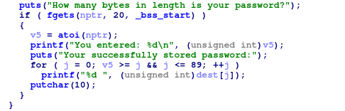
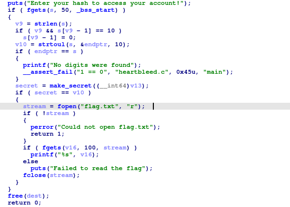
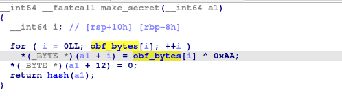
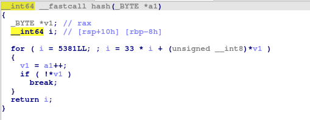
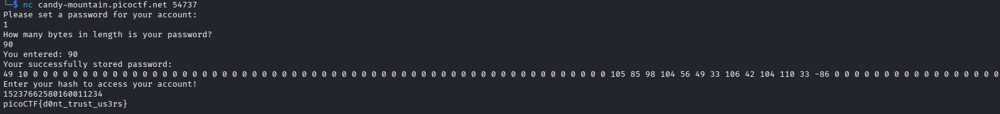

## Secure Password Database
### Đề bài
I made a new password authentication program that even shows you the password you entered saved in the database! Isn't that cool?

### Giải
Đề bài cho file `system.out` là file thực thi ELF. Sử dụng IDA để dịch ngược. Tại hàm main, khai báo mảng `dest` char 90 ký tự được cấp phát động và lưu ký tự của mảng `obf_bytes` được XOR với `0xAA` từ index 60 đến 72


Chương trình tiếp tục nhận password từ người dùng và để người dùng tự khai báo mật khẩu dài bao nhiêu rồi lưu mật khẩu này vào `dest` và in `dest` dưới dạng số theo khai báo độ dài của người dùng. Điều này có thể dẫn đến lỗ hổng heartbleed
>[!Note] 
> Heartbleed là lỗ hổng khi kẻ tấn công gửi payload ít hơn so với chiều dài khai báo. Chương trình không kiểm tra lại dẫn đến in ra vùng nhớ kế tiếp



Sau đó chương trình yêu cầu nhập hash để đăng nhập. Code thực hiện lấy input người dùng và so sánh với `secret` được tạo từ hàm `make_secret`. Nếu khớp thì trả lại flag.



Hàm `make_secret` sử dụng 12 ký tự đầu tiên từ mảng `obf_bytes` được XOR với `0xAA` rồi gọi hàm `hash` để thực hiện tính và trả về hash vào secret.



Vậy việc cần làm để lấy được flag là: khai thác lỗ hổng heartbleed để lấy được ký tự từ mảng `obf_bytes`, thực hiện tính hash và nhập kết quả lại chương trình
``` python
s = input().encode()
h = 5381
for b in s:
    h = ((h * 33) + b) & 0xFFFFFFFFFFFFFFFF
print(h)
```


FLAG: **picoCTF{d0nt_trust_us3rs}**