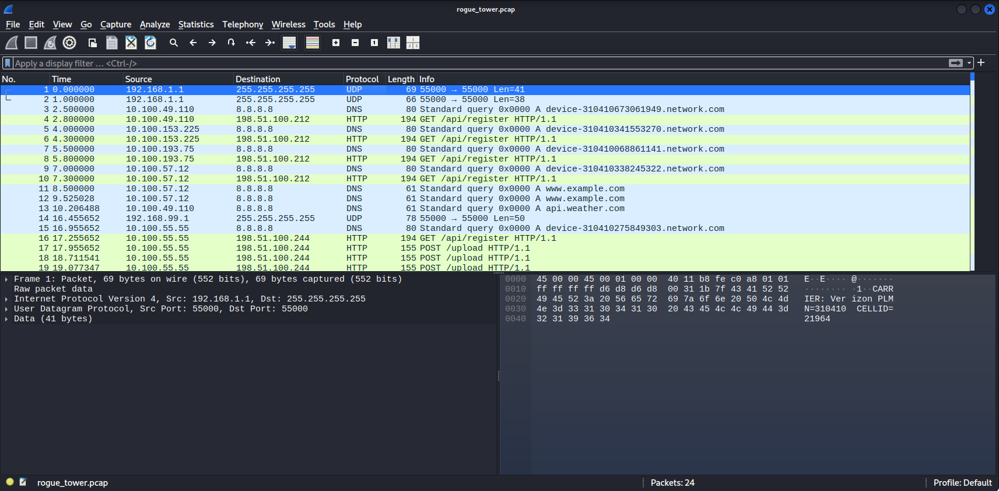
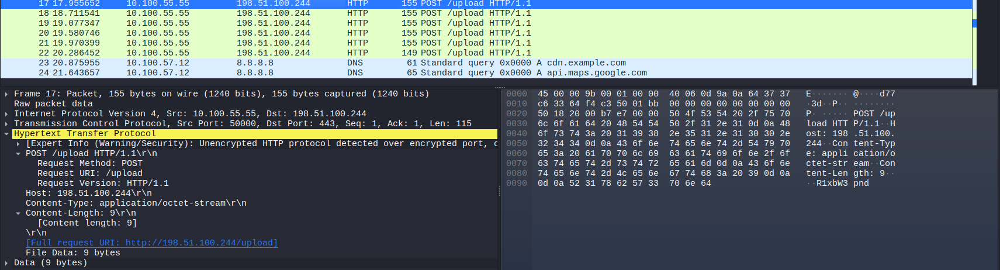
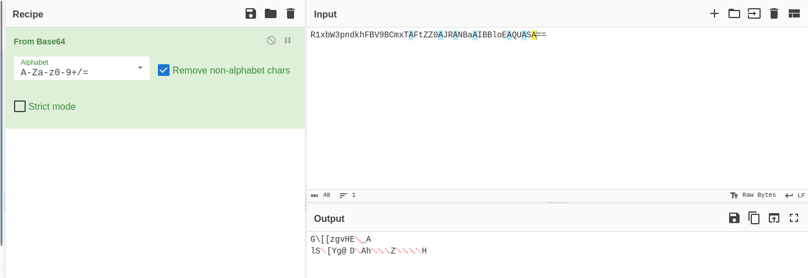
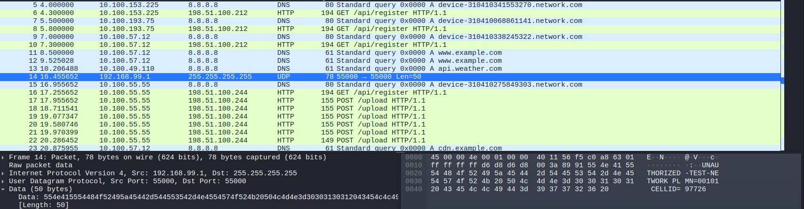
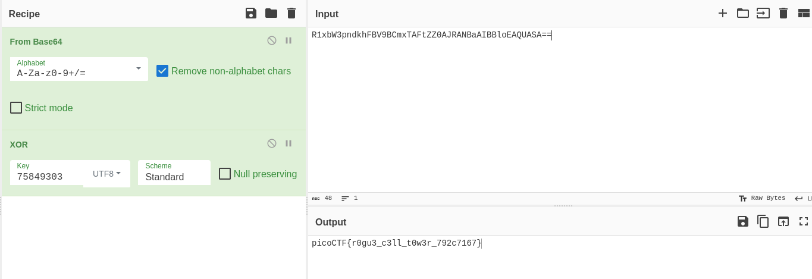

## Rogue Tower
Sau khi tải về thì nhận được một file `.pcap`, thực hiện mở file bằng wireshark



Nhận thấy có một loạt các gói tin `HTTP POST` từ `No.17` đến `No.22`, tiến hành kiểm tra sâu hơn từng gói tin này thì bên trong dữ liệu được gửi đi là một đoạn mã base64



Ghép nối các đoạn mã base64 này và thực hiện giải mã thì được một chuỗi gồm các ký tự lạ có thể vẫn đang bị mã hóa



Sử dụng gợi ý từ picoCTF, nhận thấy có `UNAUTHORIZED-TEST-NETWORK` từ gói tin `No.14` nên đây chính là rogue tower và có `CELLID=97726`


Gợi ý cho biết khóa mã hóa được gửi đi nằm trong IMSI của máy nạn nhân, mình thực hiện tìm đến kết nối có `CELL:97726` và lấy được mã IMSI
```
310410275849303
```

>[!Note] 
> IMIS (International Mobile Subscriber Identity) là mã số nhận dạng thuê bao di động quốc tế, bao gồm 15 chữ số duy nhất được lưu trữ trên thẻ SIM. Cấu trúc gồm mã quốc gia (MCC), mã mạng di động (MNC) và số nhận dạng thuê bao (MSIN)

Ở đây mình nghĩ đến mã hóa XOR thường được dùng trong network transfer, sử dụng một phần mã IMSI làm key. Biết rằng flag trong picoCTF có dạng `picoCTF{` nên viết script để thực hiện Known Plaintext Attack (KPA)
``` python
import base64

cypher_text = "R1xbW3pndkhFBV9BCmxTAFtZZ0AJRANBaAIBBloEAQUASA=="
plain_text = "picoCTF{"

payload = base64.b64decode(cypher_text)

result = ""

for i in range(len(plain_text)):
    key = chr(payload[i] ^ ord(plain_text[i]))
    result += key

print(result)
    
#75849303
```


Giải mã toàn bộ phần còn lại sử dụng key đã tìm được


FLAG: **picoCTF{r0gu3_c3ll_t0w3r_792c7167}**