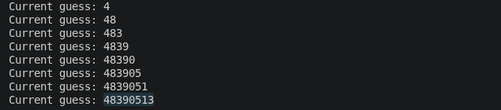

## SideChannel
Sau khi tải về thì được file 'pin_checker' là file ELF. Cấp quyền chạy và chạy file này thì cần nhập vào mã pin 8 ký tự và chương trình sẽ thông báo mã pin đúng/sai.
```
chmod +x pin_checker
./pinchecker
```

Đề bài nhắc đến side-channel attack là phương pháp tấn công dựa vào biểu hiện vật lý của chương trình. Ở đây mình nghĩ đến timing-based side-channel, nếu chương trình được code để so sánh 2 chuỗi nhập vào lần lượt từng ký tự từ đầu đến cuối thì thời gian chạy của chuỗi gần đúng so với mã pin sẽ lâu hơn thời gian chạy của chuỗi sai. Thực hiện viết script tấn công
``` python
import subprocess
import time
import string

pass_length = 8

def get_timing(password):
    input_data = password + "\n"

    start = time.perf_counter_ns()
    subprocess.run(["./pin_checker"], 
                   input=input_data,
                   text=True,
                   stdout=subprocess.DEVNULL, 
                   stderr=subprocess.DEVNULL)
    end = time.perf_counter_ns()
    return end - start

chars = string.digits
found_password = ""

for position in range(pass_length):
    best_char = ""
    max_time = 0
    
    for c in chars:
        trial = found_password + c + "0" * (pass_length - 1 - len(found_password))
        
        #Chạy nhiều lần nhằm đảm bảo tránh nhiễu
        total_time = sum(get_timing(trial) for _ in range(10)) 
        
        if total_time > max_time:
            max_time = total_time
            best_char = c
            
    found_password += best_char
    print(f"Current guess: {found_password}")
```
Chạy script, nhận được mã pin và submit thì lấy được flag



FLAG: **picoCTF{t1m1ng_4tt4ck_914c5ec3}**