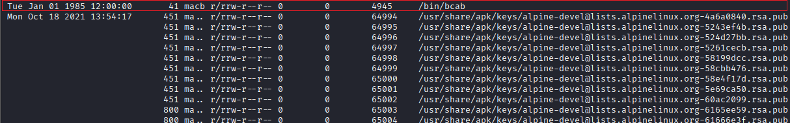

## Timeline 0
Sau khi tải về và giải nén thì được file `partition4.img`. Bảng phân vùng sử dụng chuẩn MBR  

Do đề bài có nhắc đến timeline khiến mình nghĩ đến xây dựng timeline của ổ đĩa. Trích xuất dữ liệu thời gian, xây dựng timeline và lưu lại:
```
fls -r -m / partition4.img | mactime -b > timeline.txt
```


Đọc file `timeline.txt` thì thấy có 1 file lạ được tạo từ năm 1985
=> Thực hiện điều tra sâu hơn file này



Trích xuất nội dung file này thì thu được 1 đoạn dữ liệu được mã hóa bằng base64, thực hiện giải mã
```
icat partition4.img 4945 | base64 -d
#71m311n3_0u7113r_h3r_43a2e7af
```
FLAG: **picoCTF{71m311n3_0u7113r_h3r_43a2e7af}**
