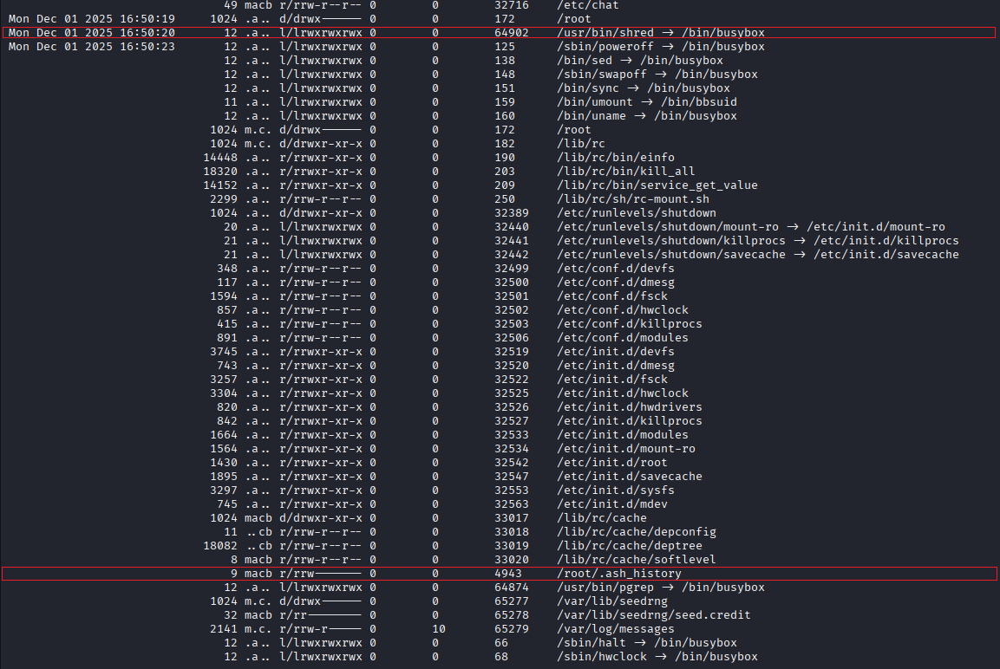
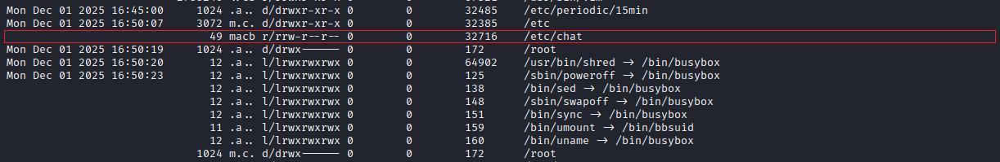

## Timeline 1
Sau khi tải về và giải nén thì được file `partition4.img`.

Do đề bài có nhắc đến timeline khiến mình nghĩ đến xây dựng timeline của ổ đĩa. Trích xuất dữ liệu thời gian, xây dựng timeline và lưu lại:
```
fls -r -m / partition4.img | mactime -b > timeline.txt
```


Tại đoạn cuối timeline, thấy có những hành động bất thường khi sử dụng `shred` (xóa và ghi đè dữ liệu), làm mới `/.ash_history` (file lịch sử câu lệnh)



Truy ngược lại trước khi có các hành động anti-forensic thì thấy có tạo 1 file có tên lạ được tạo trong `/etc`
=> Thực hiện điều tra sâu hơn file này


Trích xuất nội dung file này thì thu được 1 đoạn dữ liệu được mã hóa bằng base64, thực hiện giải mã
```
icat partition4.img 32716 | base64 -d
#573417h13r_7h4n_7h3_1457_58527bb222
```
FLAG: **picoCTF{573417h13r_7h4n_7h3_1457_58527bb222}**