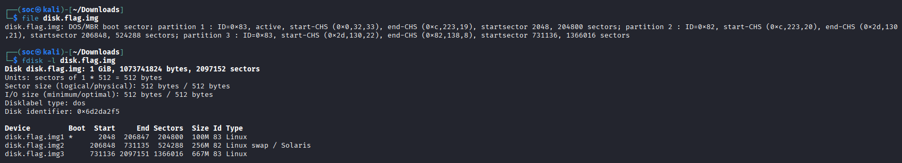
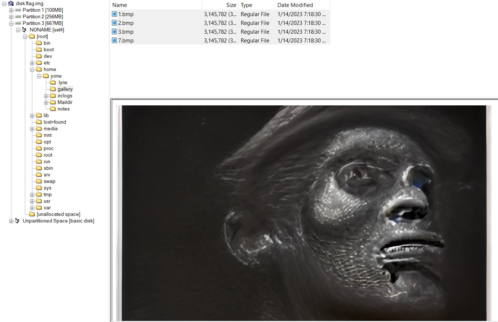
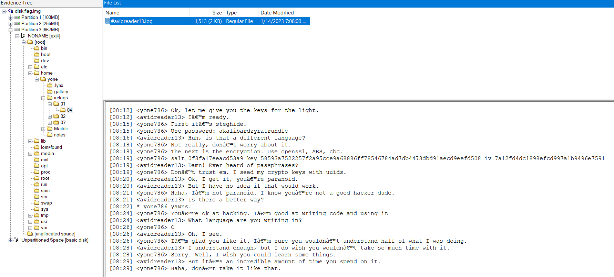
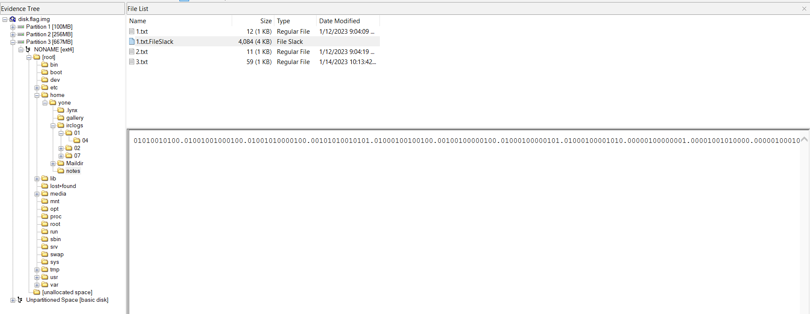
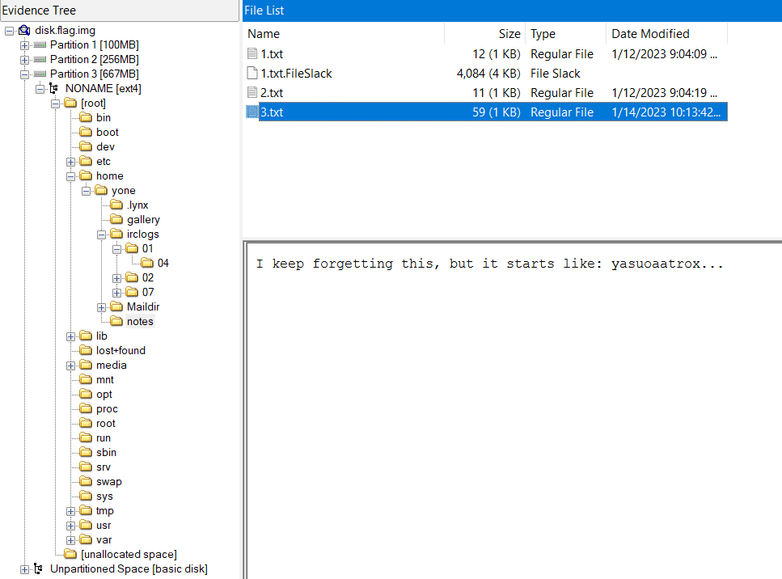
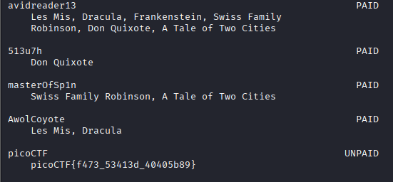

## UnforgottenBits
Sau khi tải về và giải nén thì được file `disk.flag.img`.
Kiểm tra `disk.flag.img` thì đây là một disk image sử dụng bảng phần vùng chuẩn MBR,gồm 3 phân vùng. Trong đó phân vùng 3 là lớn nhất nên có thể đây chính là phân vùng Root File System (/)



Mở file bằng `FTK Imager`, thấy có các file ảnh `.bmp` và cuộc hội thoại sau nên sử dụng `steghide` để tìm file ẩn và `openssl` để giải mã 




Khi tìm file ẩn bằng `steghide` sử dụng passphrase tìm được từ cuộc hội thoại thì được 3 file từ `1.bmp` `2.bmp` `3.bmp` và không trích xuất được từ `7.bmp`. Sử dụng `openssl` để giải mã các file đã được trích xuất thì được 3 file text không có nội dung gì hữu ích bên trong


Tìm thêm trong ổ đĩa thì có file `1.txt.FileSlack` có nội dung toàn ký tự `0` `1` `.`. Thử chuyển nội dung từ binary thì cũng không thu được gì



Tìm kiếm thêm thì có thấy lịch sử duyệt web thì người này tìm kiếm các phương pháp biểu diễn dữ liệu. Trong đó có golden ratio base được biểu diễn bằng các ký tự `0` `1` `.` như `1.txt.FileSlack`


| Decimal | Powers of φ | Base φ |
| --- | ---------- | ----------- |
|  1  | φ0 | 1 |
|  2  | φ1 + φ−2 | 10.01 |
|  3  | φ2 + φ−2 | 100.01 |
|  4  | φ2 + φ0 + φ−2 | 101.01 |
|  5  | φ3 + φ−1 + φ−4 | 1000.1001 |
|  6  | φ3 + φ1 + φ−4 | 1010.1001 |
|  7  | φ4 + φ−4 | 10000.0001 |
|  8  | φ4 + φ0 + φ−4 | 10001.0001 |
|  9  | φ4 + φ1 + φ−2 + φ−4 | 10010.0101 |
|  10  | φ4 + φ2 + φ−2 + φ−4 | 10100.0101 |


>[!Note] 
> Golden ratio base (phinary) là hệ thống số không nguyên sử dụng tỷ lệ vàng (1.618...) làm cơ số


Viết script để giải mã `1.txt.FileSlack` từ phinary với mỗi phinary có độ dài 15 ký tự `00000000000.000`
``` python
phi = 1.618
phinary_digit = 15

input = "01010010100.01001001000100.01001010000100.00101010010101.01000100100100.00100100000100.01000100000101.01000100001010.00000100000001.00001001010000.00000100010010.01000100010010.01001001001000.10001001000101.01001001010000.00001001000100.01001001010001.00000100000010.01000100010000.00001001001000.10000100010100.01000000010100.01001010000010.00101001010000.00001010101000.10000100100100.00101001000100.01000100010100.01001001010001.00000100010010.01000100010000.00001001000101.01000100010010.01000100010001.00000100001000.10001001000101.01001001001010.00000100010100.01000100000100.01000100010001.00000100000001.00000100001010.00000100010001.00001001000100.01000100000001.00000100001010.00000100001000.10000100000001.00000100010010.01001001001010.00000100000100.01000100010001.00000100001000.10001001010000.00001001010000.00000100000101.01001001000100.01000100010010.01000100010010.01001001000100.01000100010010.01000100000101.01001001000100.01001001001010.00000100010100.01000100010001.00000100000100.01000100000100.01000100000010.01000100010001.00001001000101.01000100010010.01000100000010.01001001010001.00001001001010.00001001001000.10000100000100.01001001000101.01001001000101.01000100010010.01001001010000.00000100010010.01001001001000.10001001000100.01000100010010.01000100010001.00000100000101.01000100010000.00001001001010.00001001000100.01000000010100.01001001010101.01001010100010.00100100100100.00100100010100.01000100000001.00000100010010.01000100001000.10000100001010.00000100010010.01001001010000.00000100001000.10000100010010.01001001010001.00001001001000.10000100010010.01001001001010.00001001000101.01000100000010.01001001001000.10000100001010.00001001000100.01000100001000.10000100010000.00001001010001.00000100000010.01000100010010.01001001010001.00000100000001.00001001010001.00001001010000.00001001000101.01000100000010.01000100000010.01000100010100.01001001010001.00000000010100.010"

def convert(phinary_str):
    decimal = 0

    first, last = phinary_str.split('.')
    first = first[::-1]

    for i in range(len(first)):
        if first[i] == '1':
            decimal += pow(phi,(i))
    for i in range(len(last)):
        if last[i] == '1':
            decimal += pow(phi,-(i+1))

    return round(decimal)

for i in range(0, len(input), phinary_digit):
    chunk = input[i:i+phinary_digit]
    
    output = ""
    print(chr(convert(chunk)), end="")
```


Chạy file và được kết quả có thể là khóa để mở cho `7.bmp`
```
salt=2350e88cbeaf16c9
key=a9f86b874bd927057a05408d274ee3a88a83ad972217b81fdc2bb8e8ca8736da
iv=908458e48fc8db1c5a46f18f0feb119f
```


Cũng trong `notes` thì trông đoạn ký tự trông giống kiểu của steghide passphrase đã được dùng cho ảnh `1.bmp` `2.bmp` `3.bmp` nên có thể đây là passphrase của `7.bmp`



Viết script sinh password từ list tướng LOL
```
Aatrox
Ahri
Akali
Akshan
Alistar
Amumu
Anivia
Annie
Aphelios
Ashe
Aurelion Sol
Azir
Bard
Bel'Veth
Blitzcrank
Brand
Braum
Caitlyn
Camille
Cassiopeia
Cho'Gath
Corki
Darius
Diana
Dr. Mundo
Draven
Ekko
Elise
Evelynn
Ezreal
Fiddlesticks
Fiora
Fizz
Galio
Gangplank
Garen
Gnar
Gragas
Graves
Gwen
Hecarim
Heimerdinger
Illaoi
Irelia
Ivern
Janna
Jarvan IV
Jax
Jayce
Jhin
Jinx
Kai'Sa
Kalista
Karma
Karthus
Kassadin
Katarina
Kayle
Kayn
Kennen
Kha'Zix
Kindred
Kled
Kog'Maw
K'Sante
LeBlanc
Lee Sin
Leona
Lillia
Lissandra
Lucian
Lulu
Lux
Malphite
Malzahar
Maokai
Master Yi
Milio
Miss Fortune
Mordekaiser
Morgana
Nami
Nasus
Nautilus
Neeko
Nidalee
Nilah
Nocturne
Nunu & Willump
Olaf
Orianna
Ornn
Pantheon
Poppy
Pyke
Qiyana
Quinn
Rakan
Rammus
Rek'Sai
Rell
Renata Glasc
Renekton
Rengar
Riven
Rumble
Ryze
Samira
Sejuani
Senna
Seraphine
Sett
Shaco
Shen
Shyvana
Singed
Sion
Sivir
Skarner
Sona
Soraka
Swain
Sylas
Syndra
Tahm Kench
Taliyah
Talon
Taric
Teemo
Thresh
Tristana
Trundle
Tryndamere
Twisted Fate
Twitch
Udyr
Urgot
Varus
Vayne
Veigar
Vel'Koz
Vex
Vi
Viego
Viktor
Vladimir
Volibear
Warwick
Wukong
Xayah
Xerath
Xin Zhao
Yasuo
Yone
Yorick
Yuumi
Zac
Zed
Zeri
Ziggs
Zilean
Zoe
Zyra
```
``` python
with open('lol_champs.txt') as f:
    lines = f.read().splitlines()

with open("lol_wordlist.txt", "a") as g:
    for x in lines:
        for y in lines:
            pw = ("yasuoaatrox"+x+y+"\n").lower()
            g.write(pw)
```

Viết script bruteforce dùng từ list password đã sinh
``` python
import subprocess

def dict_attack(wordlist):
    for x in wordlist:
        try:
            subprocess.check_output(["steghide", "extract", 
                                     "-sf", "7.bmp", "-p", x], 
                                     stderr=subprocess.DEVNULL)
            return x
        except subprocess.CalledProcessError:
            pass
    return 0


with open('lol_wordlist.txt') as f:
    lines = f.read().splitlines()

passphrase = dict_attack(lines)
    
if passphrase:
    print("passphrase: " + passphrase)
    
#Passphrase: yasuoaatroxashecassiopeia
```

Sử dụng passpharse này cho steghide `7.bmp` và dùng `openssl`  và khóa đã tìm để giải mã thì được file chứa flag


FLAG: **picoCTF{f473_53413d_40405b89}**