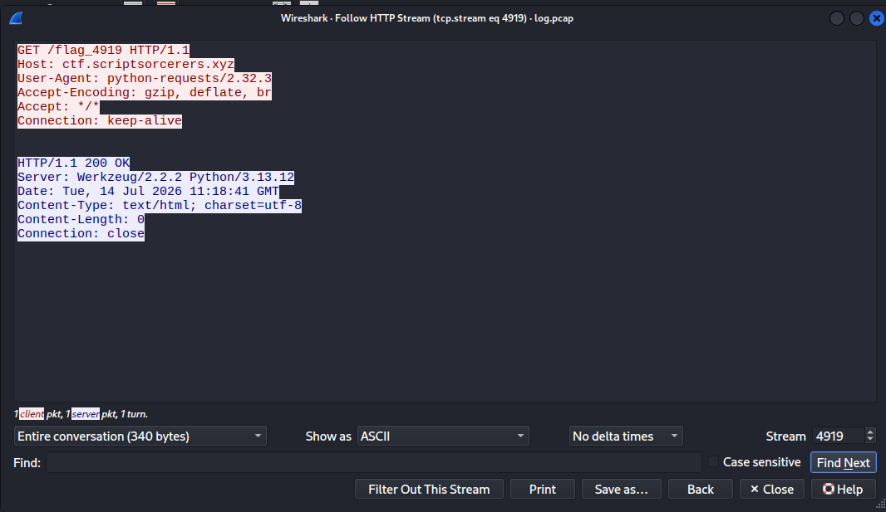
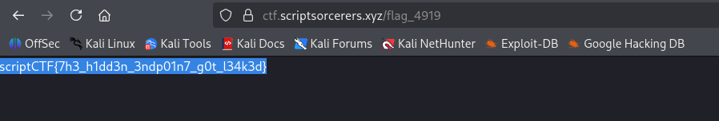

## Bruteforced
### Đề bài
Help! Our website got bruteforced. Hopefully the attacker did not leak anything.

### Giải
Đề bài cho fle `log.pcap`, mở và phân tích bằng wireshark thì thấy 1 request GET đến các đường dẫn `/flag_N` với N trải dài từ 0 đến 9999. Phần lớn response trả về `404 NOT FOUND` trừ request đến `/flag_4149`

Kết nối đến host và đường dẫn này thì tìm được flag

FLAG: **iptCTF{7h3_h1dd3n_3ndp01n7_g0t_l34k3d}**