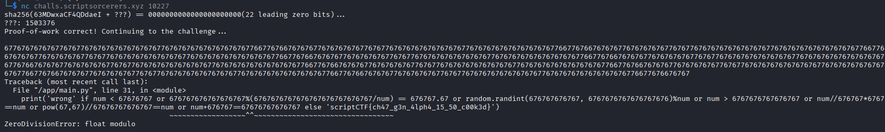

## flagcheck67
### Đề bài
i heard my lil bro's password was [READACTED]. just connect to the server and enter it for me, would u?

Note: Please test your solve locally before going on the remote! It has a Proof-of-Work (POW). Solver given in second attachment

### Giải
Đề bài cho 2 file gồm `check.py` và `pow-solver.py` trong đó `pow-solver.py` được dùng để tính Proof-of-work còn `check.py` nhận input từ người dùng và kiểm tra điều kiện và in ra kết quả được hardcode
``` python
import random, time
inp = input().strip()
assert all([(x in "67") for x in list(inp)])
num = float(inp)  
print('wrong' if num < 67676767 or 676767676767676767%(6767676767676767676767676767/num) == 676767.67 or random.randint(676767676767, 6767676767676767676)%num or num > 6767676767676767 or num//676767*676767==num or pow(67,67)//67676767676767==num or num+676767==67676767676767 else 'scriptCTF{fakeflag6767}')
```

Chương trình sẽ in ra flag nếu tất cả các điều kiện không thỏa mãn. Trong đó có điều kiện chia hết phụ thuộc vào random khiến việc tìm 1 số không thỏa mãn các điều kiện còn lại cũng khó có thể thỏa mãn điều kiện random.

Do chương trình không có kiểm tra input đầu vào trước khi chuyển về float dẫn đến có thể nhập 1 số toàn 6 và 7 vô cùng lớn để dẫn đến tràn số, python traceback và in ra dòng lệnh gây lỗi có chứa flag

>[!Note] 
> Với biến dạng int, long long python lưu trữ dưới dạng 1 mảng các chữ số, có thể cấp phát thêm nên không bị tràn số khi bộ nhớ RAM vẫn còn chỗ. Kiểu float được triển khai như double của C++, được ánh xạ trực tiếp vào thanh ghi phần cứng dẫn đến khi số quá lớn gây tràn số

Kết nối đến server và thực hiện


FLAG: **scriptCTF{ch47_g3n_4lph4_15_50_c00k3d}**